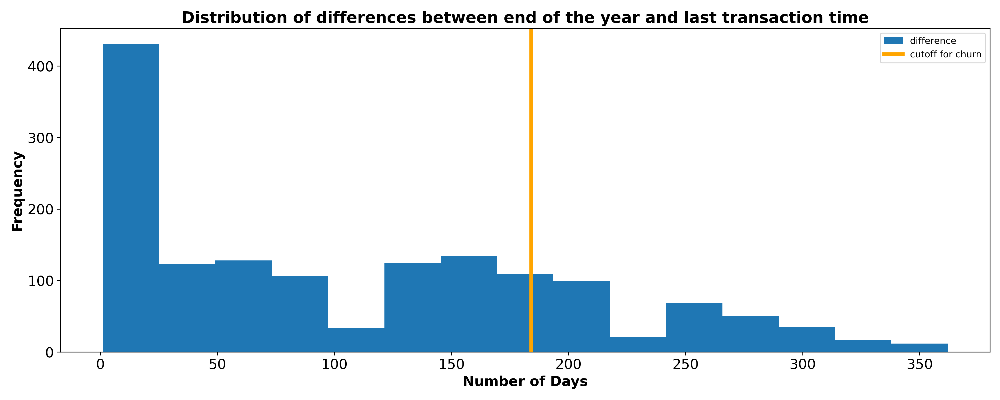

# Predicting-Customer-Churn-For-Brass

## Author: Stanley Azuakola

---

# Problem Statement
[Brass Business Bank (Brass)](https://www.trybrass.com/about/), a B2B company - founded in Lagos, Nigeria [less than three years ago](https://brassbanking.medium.com/introducing-brass-banking-nigerias-local-businesses-143c0ccf2bb8) - has asked me to predict customer churn for their business using a subset of customers and their transactions. Churn refers to when customers stop using a product. Brass offers commercial-grade current accounts, financial products, education, financing and partnership to support its clients which are all businesses. Churn is a big problem for this business - as it is with many others - because churning customers means loss of revenues and potential profits, and would then lead to expending more money to find new customers which is a more expensive undertaking than retaining existing customers. Churn can also be harmful to the brand if churned customers who leave because of bad experience(s) spread negative word of mouth.

The requirements for this task are as follows:
1. To train a classifier that can predict customer churn for Brass.
2. To define churn for Brass - using the data provided by the company. In the data provided, Brass did not label any customer as `churned` or `not churned`. It is my responsibility to come up with a definition of churn to be used for my analysis and modeling. 
3. To engineer features that will be used in predicting churn. Brass was unable to share much demographic data due to security concerns about sharing customer information with me as a non-staff who is not physically on site. 

---

# Metrics for Evaluation

Since the classes in this project are unbalanced, we cannot rely exclusively on accuracy as the metric of choice for evaluation. Brass does not tell me what metrics to use in my evaluation, but I chose the below five metrics.

1. Accuracy score
2. Balanced accuracy score
3. Recall/Sensitivity
4. Geometric mean
5. Fbeta score 

Explanations for my choice of these metrics are provided in my [first notebook](./notebooks/01_introduction.ipynb). 

---

# Contents

### Jupyter notebooks
1. [Introduction and Data cleaning](./notebooks/01_introduction.ipynb)
2. [Exploratory Data Analysis](./notebooks/02_eda.ipynb)
3. [Feature Engineering](./notebooks/03_feature_engineering.ipynb)
4. [Preprocessing and Modelling](./notebooks/04_modeling.ipynb)
5. [Analysis and Conclusions](./notebooks/05_analysis_and_conclusions.ipynb)

# Dataset used for analysis
Brass provided me with two anonymized and unfiltered datasets:
1. A [transactions.csv](./data/transactions.csv) file which contained more than 700k rows of transactions over the course of the year 2022. 
2. A [customers.csv](./data/customers.csv) file which contained information for a sample of almost 8k customers.

The two datasets had not been filtered, so there were lots of customers in the `customers` sample without any transaction in the `transactions` sample. And there were rows of transactions in the `transactions` sample that were carried out by customers who were not in the `customers` sample. Using SQL, I filtered only those customers in the `customers` sample who had transactions recorded in the `transactions` sample. This reduced the number of transactions from more than 700_000 to approximately 300_000. Even more significantly, it reduced the number of unique customers from almost 8_000 to roughly 1_500 unique customers. 

# Data Dictionary
After joining the two datasets together, these are the features that remained in the combined dataset.
|**S/No**|**Feature**|**Type**|**Description**|
|:---|:---|:---|:---|
|1|`id`|int64|Unique ID for each customer in the dataset|
|2|`registration_type`|object|Type of business entity based on registration of the customer|
|3|`industry`|object|Industry type for customer's business|
|4|`transaction_type`|object|One of either debit or credit transaction|
|5|`amount`|int64|Amount debited or credited per transaction. `amount` is in **kobos.** This is Nigerian currency. **100 kobos = 1 Naira**. This is similar to how 100 cents = 1 US dollar|
|6|`ledger_balance`|int64|Balance in the account at the end of the business day and starting balance at the beginning of the next business day. `ledger_balance` is in **kobos.** This is Nigerian currency. **100 kobos = 1 Naira**. This is similar to how 100 cents = 1 US dollar|
|7|`available_balance`|int64|Amount available for withdrawal at a given moment. `available_balance` is in **kobos.** This is Nigerian currency. **100 kobos = 1 Naira**. This is similar to how 100 cents = 1 US dollar|
|8|`date`|datetime|Date of transaction. All dates are in 2022, ranging from `2022-01-04` to `2022-12-31`| 

---
# Summary
In the five notebooks in this project, I go through the following processes:
 1. Cleaning: As mentioned earlier, the data provided contained extraneous rows due to a mismatch in samples provided to me. I removed those using SQL by joining the datasets together into one combined - [brass.csv](./data/brass.csv) dataset which I then exported for use in my analysis and modeling. Several data cleaning operations were carried out including but not limited to - dropping columns, renaming, converting to datetime objects, converting currency, among others. 
 
2. Defining Churn: Since Brass did not label customers as either `churned` or `not churned`, I analysed the dataset to define what churn could represent in the company. In my analysis, I realized that presently Brass accounts can lay dormant for long periods but it does not mean that the customer has churned. I spoke with Brass officials who confirmed this to be true, explaining the seasonality of some clients. I found the following in my analysis:
|What|How long|
|---|---|
|Mean time between most recent transactions per customer and year end|107 days|
|Median time between most recent transactions per customer and year end|92 days|
|**75th percentile**|**184 days**|

I decided to use the 75th percentile rather than any of those averages as the cutoff for churn. Hence, 184 days was the cutoff used in this project to define churn. Accounts without transactions in over 184 days were considered to have churned. As can be seen in the distribution below, there were still customers in whose accounts transactions still happened beyond the 184 days cutoff, but on investigation most of those were either bank charges or small amounts. I felt comfortable retaining the cutoff at 184 days. 

